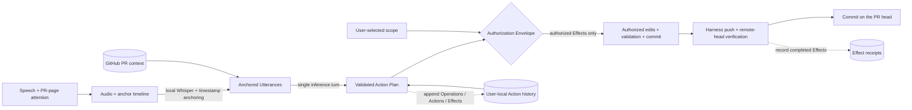
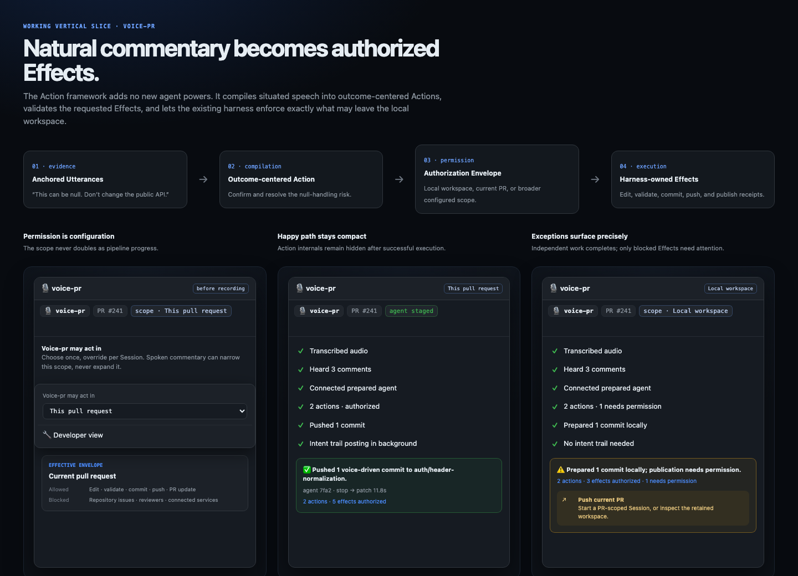
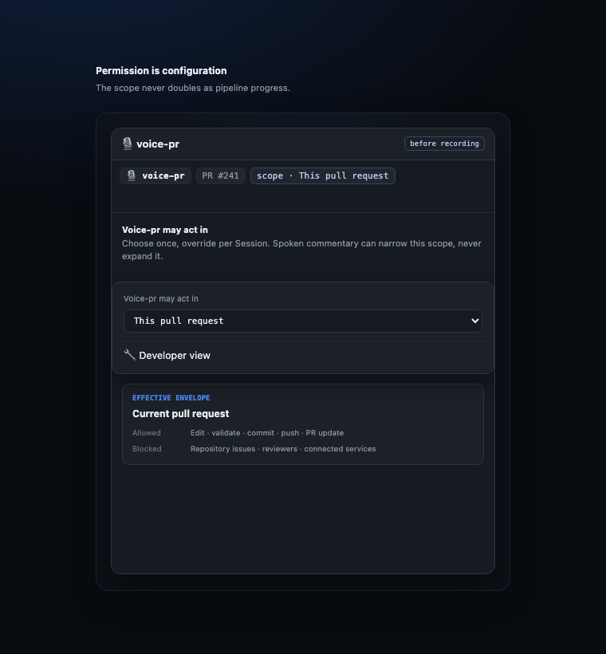

# voice-pr

Speak while reviewing your GitHub PR. As soon as the page loads, the extension
deterministically resolves the PR context, refreshes a repository mirror, and
prepares a reusable PR-head worktree. Explicit Record then stages a local Cursor
agent without inference. When recording stops, local Whisper transcribes the
audio and one focused agent turn interprets the fuzzy requests, edits, validates,
and commits; the bridge pushes to the PR branch.

## Pipeline



The [end-to-end data flow](docs/data-flow.md) expands this path across the
extension, local bridge, Cursor agent, local stores, and GitHub—including the
page-load preparation and record-start warm paths that happen before Dispatch.

There is no orchestrator, work-item queue, mayor, polecat, refinery, or direct
LLM call. Page load prepares deterministic context, record start pays only agent
setup, and record stop sends the anchored speech for a single inference turn.

## Voice Action framework

The warmed agent must register a typed Action Plan before publication. Actions
describe independently resolvable outcomes; Effects describe the existing tools
used to realize them. The local harness validates every Effect against the user's
configured scope, owns authenticated publication, and refuses to push when the
agent skips compilation.

The extension defaults to the current behavior: voice-pr may edit, test, commit,
push to the current PR, and post the intent trail. A visible, labelled Scope
control can narrow or expand the effective envelope from read-only through
connected services. Scope is reset for every recording session; broader access
is explicitly labelled and never silently becomes a later session's default.
Spoken commentary can narrow that scope, but never expand it.

Action history, Operation provenance, Effect receipts, transcripts, and raw audio
remain user-local. GitHub remains the collaboration surface; successful runs show
only a compact Action summary, while permission and clarification exceptions are
surfaced explicitly.

### Demo





Run the interactive gallery locally with `npm run demo:action-framework`, then
open `http://127.0.0.1:4173/scripts/action-framework-gallery.html`.

The throwaway reimagining prototype lives at
`http://127.0.0.1:4173/scripts/action-framework-reimagined.html?variant=A`.
Use the floating arrows (or the keyboard arrow keys) to compare variants A–C;
the small state control exercises idle, working, success, and blocked.

## Success metric

The primary metric is:

```text
stop-to-patch = patchReadyAt - recordingStoppedAt
```

Each result includes:

- `inferenceTurnsBeforeStop` — always `0` (setup is non-inferential)
- `recordToAgentReadyMs` — record click to staged SDK agent
- `preparationHit` and `preparationAgeMs`
- `warmMs`
- `warmWaitMs` — agent setup still on the critical path after recording stopped
- `executionMs`
- `stopToPatchMs`

Page-load traces also include `pageLoadToPreparedMs`. Patch acceptance,
stale-head refreshes, expired unused preparations, and disk usage are guardrails.

After Dispatch, the capture-panel clock switches from recording duration to a
live `commit 0:00` timer. It stops when the harness has pushed the commit to the
PR branch and is corrected to the server-authoritative `stopToPatchMs` result.

## Requirements

- Node.js **22.13+**
- `CURSOR_API_KEY`
- Authenticated `gh` CLI with push access to the PR repository
- `ffmpeg`
- `whisper-cli` and a local whisper.cpp model
- Chrome

Install:

```bash
npm install
brew install ffmpeg whisper-cpp
mkdir -p ~/.cache/whisper
curl -fsSL -o ~/.cache/whisper/ggml-large-v3-turbo-q5_0.bin \
  https://huggingface.co/ggerganov/whisper.cpp/resolve/main/ggml-large-v3-turbo-q5_0.bin
export CURSOR_API_KEY="cursor_..."
```

## Run

```bash
npm start
```

Then load `extension/` as an unpacked Chrome extension and open a GitHub PR's
Files changed view.

Experimental gaze tracking stays on-device, but the extension does **not** vendor WebGazer's face-model assets.
Its first run may fetch those assets from the model hosts explicitly listed in
the extension CSP.

For an always-on macOS bridge:

```bash
export CURSOR_API_KEY="cursor_..."  # captured in ~/.voice-pr/cursor-api-key (0600)
npm run daemon:install
npm run daemon:status
npm run daemon:restart
npm run daemon:logs
```

## Runtime design

`server.js` exposes:

- `POST /api/prepare` — performs deterministic context, mirror, and PR-head
  worktree preparation on passive page load; never starts inference.
- `POST /api/warm` — atomically leases prepared state and stages an idle agent.
- `POST /api/dispatch` — transcribes, anchors, and sends the final instructions
  to that same agent while streaming NDJSON progress.
- `GET /api/preflight` — checks Whisper, GitHub auth, and Cursor SDK auth.
- `GET /api/context` and `POST /api/transcribe` — standalone diagnostic paths.

The bridge binds only to `127.0.0.1`, accepts browser requests only from Chrome
extension origins, and caps request bodies at 100 MB.

`lib/agent.js` owns the hot agent:

- Bare repository mirrors live under `~/.voice-pr/repo-cache`.
- Prepared and session worktrees live under `~/.voice-pr/workspaces`.
- PR-head preparations are deduplicated, capped, and expire after 10 minutes.
- A prepared worktree is atomically leased to one recording; concurrent
  recordings receive isolated worktrees.
- Concurrent recordings can warm independently.
- Final writes to the same PR branch remain serialized.
- The branch is fetched again before execution; only fast-forward drift is
  accepted.
- A completed session is idempotent in-process.
- Warm agents expire after 30 minutes by default.

The local agent loads Cursor user, team, and plugin settings so existing
Jira/MCP context can be consulted during execution. Repository-controlled
project settings are excluded, the agent runs in a sandbox, and the managed
worktree is verified before push. It never force-pushes, rebases, or amends.

## Configuration

| Environment variable | Default | Purpose |
|---|---|---|
| `PORT` | `4100` | Local bridge port |
| `CURSOR_API_KEY` | required | Cursor SDK authentication |
| `VOICE_PR_MODEL` | `composer-2.5` with `fast=true` | Cursor model ID override; setting it disables the default Fast parameter |
| `VOICE_PR_AGENT_TTL_MS` | `1800000` | Abandoned agent lifetime |
| `VOICE_PR_PREPARE_TTL_MS` | `600000` | Unused page-load preparation lifetime |
| `VOICE_PR_PREPARE_MAX` | `6` | Maximum concurrent prepared/leased PR heads |
| `VOICE_PR_CONTEXT_TTL_MS` | `120000` | PR/Jira/CI context cache lifetime |
| `VOICE_PR_CONTEXT_CACHE_MAX` | `50` | Maximum cached PR context entries |
| `VOICE_PR_WORKSPACE_DIR` | `~/.voice-pr/workspaces` | Session worktrees |
| `VOICE_PR_REPO_CACHE_DIR` | `~/.voice-pr/repo-cache` | Bare repository mirrors |
| `VOICE_PR_WHISPER_BIN` | `whisper-cli` | whisper.cpp binary |
| `VOICE_PR_WHISPER_MODEL` | `~/.cache/whisper/ggml-large-v3-turbo-q5_0.bin` | Model |
| `VOICE_PR_ARCHIVE_DIR` | `~/.voice-pr/sessions` | Audio, transcripts, results, traces |
| `VOICE_PR_ACTION_STORE_DIR` | `~/.voice-pr/actions` | User-local Action projections, Operations, and Effect receipts |

## Validation and diagnostics

```bash
npm run check
npm run trace
npm run trace <sessionId>
```

Every page-load preparation prints its cache decisions to the bridge console and
the structured trace. A cold path reports `context-cache-miss`,
`repo-cache-miss`, and `workspace-cache-miss` followed by the corresponding
`*-created` events. A warm path reports `context-cache-hit` and
`preparation-cache-hit` without Git I/O. After a bridge restart, persistent
state is validated with `repo-cache-hit` followed by `repo-cache-current` or
`repo-cache-updated`; stale worktrees and TTL/capacity evictions emit explicit
`*-invalidated` events with a reason.

The extension saves a pending recording until the agent returns a terminal
result. Session audio, transcript, timing events, result, and structured trace
remain under `~/.voice-pr/sessions/<sessionId>/`.
